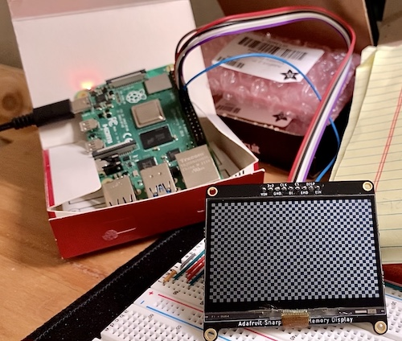

# SHARP 2.7" 400x240px memory LCD on Raspberry Pi

This repository was forked from: [MakerDyne/Memory-LCD-for-Raspberry-Pi](https://github.com/MakerDyne/Memory-LCD-for-Raspberry-Pi)

Modified for resolving compiling error from the original version of demo code, aim to validate the application of SHARP 400x270 mono memory LCD running on RaspberryPi, and keep in record for personal refrence.

## Hardware Setup
Raspberry Pi 4

Adafruit SHARP Memory Display Breakout - 2.7" 400x240 Monochrome (LS027B7DH01)

wiring:
refer to [RPi Low-level peripherals](https://elinux.org/RPi_Low-level_peripherals#General_Purpose_Input.2FOutput_.28GPIO.29)
| LCD PIN    | Rpi4 GPIO Name  | Rpi4 PIN#             | changeable? | remark  |
|------------|----------------|----------------------|-------------|---|
| 3v3        | Any [3.3v] PIN | 1/21                 |             |   |
| Gnd        | Any [GND] PIN  | 6/9/14/2025/30/34/39 |             |   |
| CLK(SCLK)  | GPIO11(SCLK)   | 23                   |             |   |
| DI(MOSI)   | GPIO10(MOSI)   | 19                   |             |   |
| CS(SS)     | GPIO23         | 16                   |             |   |
| EMD(EXTMD) |                |                      |             | no need for Adafruit module  |
| DISP       | GPIO24         | 18                   | ::check::   | no need for Adafruit module  |
| EIN(EXTIN) | GPIO25         | 22                   | ::check::   | no need for Adafruit module  |

## Compile from source code
``

last update: Dec. 9, 2021, KW.